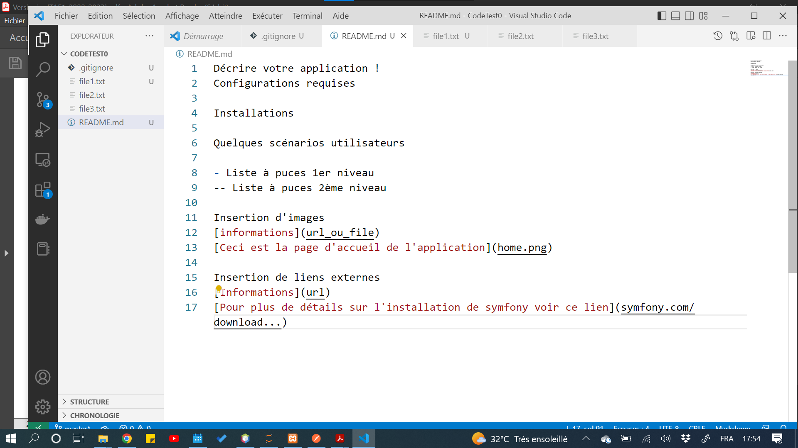

Décrire votre application !
Configurations requises

Installations

Quelques scénarios utilisateurs

- Liste à puces 1er niveau
  -- Liste à puces 2ème niveau

Insertion d'images
[informations](url_ou_file)

Insertion de liens externes
[Informations](url)
[Pour plus de détails sur l'installation de symfony voir ce lien](symfony.com/download...)
